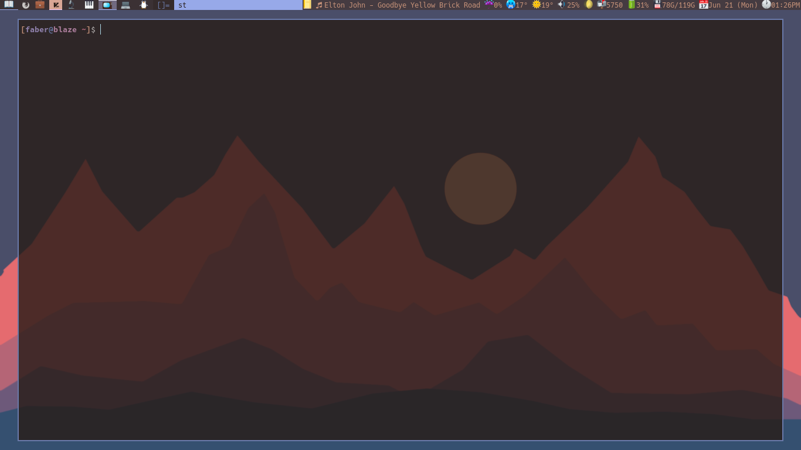

# Dwm
My build of dwm

## Patches
You can see them and 'unpatch' them if you want to.

_Little note:_ I don't use cfacts patch.

## PersonalBuild
My changes, you can refer to them in case you find them usefull. I mostly like
a baeutiful config.h with not much stuff.

**NOTE**: You need **PYWAL**

## dwm.def.c
This build is **perfect** for me I really wouldn't bother with adding or
cleaning more things, but sometimes things happen (maybe I get a new monitor,
keyboard, or the situation asks for it) so this is the file where I tinker
with, currently im working on:
- If fullscreened a window make it fakefullscreen (_start with fakefullscreen_, this prob need to be a keybinding into itself, so if a windows that is not fakefullscreened by the rules array and I wanted to make it fakefullscreen, normalstate -> fakefullscreen, without going normalstate -> fullscreen -> fakefullscreen.

Also there all a lot of comments on functions that I don't use or are useless
in some cases. Taake a look before doing anything :). dwm.c is cleanear now.

Made this in case I broke anything. This is my definitive build.
### Mayor improvements:
- xrdb patch finally working with pywal without restarting or recompiling (Mar
  01 2021)
- Layouts at startup (Apr 04 2021)
- Gaps per tag instead of per monitor (Apr 04 2021)
- Better way of handling Pywal colors (Jun 21 2021)
