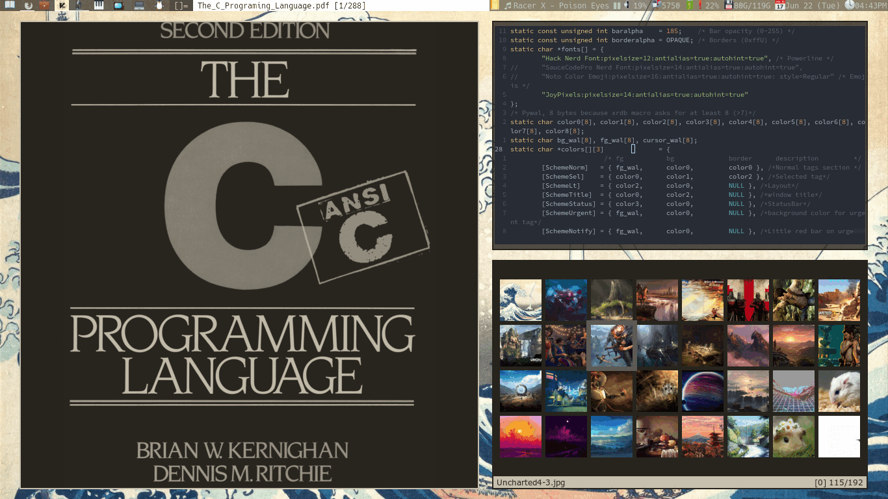

# Dwm
My build of dwm

# Features/patches
- vanitygaps (some of the specific increase/decrease on horizontal or vertical functions are commented out since I use only the general one.)
- [pywal](https://github.com/dylanaraps/pywal) color syncronization by default
- more layouts
- custom bar height
- Different color schemes for Title, Status and Layout (added 4 more shemes on top of the other mentioned: Urgent - Notify - Indicator on/of)
- Transparency on the bar
- A beautiful looking config.h file (at least for my taste :)
see:
 * [layouts.c](https://github.com/explosion-mental/Dwm/blob/main/layouts.c)

## dwm_random_wall
This is a little script that changes the wallpaper to a random one and uses
pywal. By default my dwm build syncs all colors to pywal colors. You should
**edit** the variable `img_path` to your actual path of wallpapers.

Remember, the script is copied and removes automatically by the makefile (`make
install` and `make unistall`).

_Note_: you need **pywal**

## Toggleable Features
Planned to contain window icons and systray optionally.

### Icons
edit [config.mk](https://github.com/explosion-mental/Dwm/blob/main/config.mk)

### Systray
Working...

## Patches
You can see them and 'unpatch' them if you want to.

Mines are:
- shift-tools (shift windows,tags or both either with an active client or not)

## dwm.c
dwm.def.c is not needed anymore. I'm happy with what I got.

Some little TODOS:
- systray toggleable with _#ifdef_ and _#endif_
- getenv("TERMINAL")
- depatch cfacts
- integrate dwmblocks into dwm (prob not worth it)
- <s>make [hide vacant patch](https://dwm.suckless.org/patches/hide_vacant_tags/)
  toggleable</s>
- a better way of handling layouts at startup

## Mayor improvements:
- xrdb patch finally working with pywal without restarting or recompiling (Mar
  01 2021)
- Layouts at startup (Apr 04 2021)
- Gaps per tag instead of per monitor (Apr 04 2021)
- Better way of handling Pywal colors (Jun 21 2021)
- Window icons (Jul 22 2021)
	* Icons on swallowed - unswallowed windows (Jul 23 2021)
- toggleable hide vacants tags (Jul 28 2021)
